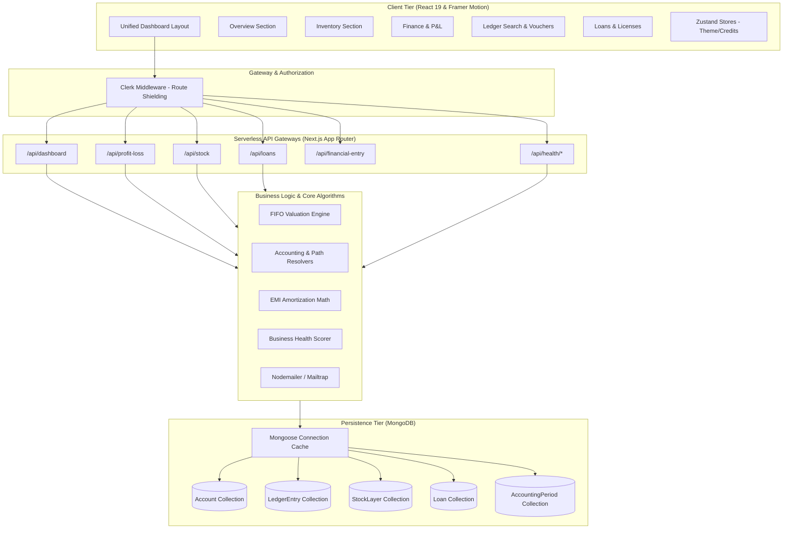

# 🚀 Solicio | Premium MSME Bookkeeping & Financial Dashboard

[](https://nextjs.org/)
[](https://react.dev/)
[](https://tailwindcss.com/)
[](https://www.mongodb.com/)
[](https://clerk.com/)
[](https://www.typescriptlang.org/)

Solicio is a premium, high-performance business administration, accounting, and financial analytics dashboard engineered for Micro, Small, and Medium Enterprises (MSMEs). By combining robust double-entry bookkeeping, sophisticated inventory costing algorithms, active loan amortization trackers, and dynamic health reports, Solicio enables modern business owners to operate with enterprise-grade clarity and compliance.

---

## 🏛️ System Architecture

Solicio utilizes a **Domain-Driven Feature Slice** pattern layered over a serverless Next.js App Router environment. This architecture ensures high modularity, strict separation of concerns, and clean API orchestration.



---

## ✨ Core Modules & Algorithms

### 📖 1. Double-Entry Bookkeeping & Materialized Paths
Accounting transactions are recorded via balanced financial entries. The chart of accounts uses a **Materialized Path** hierarchy (e.g., `/Asset/Cash`, `/Expense/Purchases`) supporting multi-level account rollups:
*   **Voucher Verification:** Strict debit/credit balance enforcement through a customizable rules schema (`src/utils/voucherRules.ts`).
*   **Locked Accounting Periods:** Prevents retrofitting transactions into past, finalized cycles, ensuring fiscal auditability (`src/utils/accounting.ts`).

### 📦 2. First-In First-Out (FIFO) Costing Engine
Inventory and COGS (Cost of Goods Sold) calculations are computed using a pure-functional FIFO layer tracking mechanism (`src/utils/fifo.ts`).
*   Each inventory acquisition creates a distinct, time-stamped `StockLayer` indicating `qtyRemaining` and unit purchase `rate`.
*   Sales dynamically consume these layers from oldest to newest.
*   **COGS Calculation:** $\text{COGS} = \text{Opening Stock} + \text{Purchases} - \text{Closing Stock}$. Underneath, the system performs a localized transaction trace:
    $$\text{COGS} = \sum (\text{Layer Unit Rate} \times \text{Consumed Quantity})$$

### 🏥 3. Business Health Scoring Algorithm
The system aggregates telemetry from ledger activity and stock logs to output an active **Business Health Score (0-100)**:
1.  **Stock Movement Score (30%):** Measures days since the last sale per product to flag slow-moving capital.
2.  **Sales Trend Score (30%):** Calculates week-over-week revenue growth.
3.  **Inventory Balance Score (20%):** Computes the Stock-to-Sales Ratio to prevent over-stocking and stockouts.
4.  **Activity Recency Score (20%):** Identifies operational gaps or periods of business dormancy.

---

## 📂 Project Directory Structure

```filepath
solicio-next/
├── public/                 # Static assets, branding images, and logos
├── src/
│   ├── app/                # Next.js App Router entry points
│   │   ├── (root)/         # Public landing page & homepage wrapper
│   │   ├── api/            # Serverless API routes (37 modular endpoints)
│   │   │   ├── profit-loss/# Costing & Profit/Loss reports
│   │   │   ├── stock/      # Stock layer and valuation operations
│   │   │   ├── health/     # Telemetry & health scoring analytics
│   │   │   └── loans/      # Debt and loan schedules
│   │   ├── dashboard/      # Primary authenticated dashboard interface
│   │   ├── transactions/   # Ledger audits & stock movement lists
│   │   ├── layout.tsx      # Main layout injecting Clerk, Providers, and Google Fonts
│   │   └── middleware.ts   # Edge middleware routing & Clerk access protection
│   │
│   ├── components/         # Reusable presentation and UI elements
│   │   ├── layout/         # Shared Header, Footer, and Navigation
│   │   ├── ui/             # Core UI cards, badges, and print buttons
│   │   └── ThemeProvider.tsx# Context provider for dark/light mode switches
│   │
│   ├── features/           # Domain-Driven feature modules (UI logic & hooks)
│   │   ├── dashboard/      # Sidebar, KPI displays, and section layouts
│   │   ├── stock/          # Sales, purchases, recipe builders, and product forms
│   │   ├── ledger/         # General ledger displays, search, and reversals
│   │   ├── parties/        # Vendor & Customer catalogs and credit options
│   │   ├── voucher/        # Ledger journal creation matrices
│   │   ├── loan_licenses/  # Loan schedules and business certificates
│   │   ├── Insights/       # Recharts trend engines and financial graphs
│   │   └── health/         # Gauges, balance panels, and activity recency
│   │
│   ├── dbConfig/           # Database layer connection and caching
│   │   └── dbConnection.ts # Cached Mongoose connection helper
│   │
│   ├── models/             # 18 Mongoose ODM Schema Definitions
│   │   ├── AccountModel.ts # Hierarchical Chart of Accounts
│   │   ├── StockLayer.ts   # FIFO stock purchase layers
│   │   ├── LedgerEntry.ts  # Balanced double-entry records
│   │   └── LoanModel.ts    # Loan structure and liabilities
│   │
│   ├── utils/              # Pure business algorithms
│   │   ├── fifo.ts         # Cost of Goods Sold calculator
│   │   ├── emiCal.ts       # Loan amortization schedule calculator
│   │   ├── gst.ts          # Direct GST/tax rates parser
│   │   └── accounting.ts   # System accounts & fiscal lock controllers
│   │
│   ├── store/              # Zustand lightweight global state stores
│   ├── hooks/              # Custom global React state hooks
│   └── types/              # Centralized TypeScript declarations
│
├── package.json            # Dependencies, scripts, and package setup
└── tsconfig.json           # Strict TypeScript configuration compiler rules
```

---

## 🛠️ Getting Started & Installation

### Prerequisites
*   [Node.js](https://nodejs.org/) (v20+ recommended)
*   [MongoDB Atlas](https://www.mongodb.com/cloud/atlas) or a running local MongoDB instance
*   [Clerk account](https://clerk.com/) for authentication configuration

### Installation

1.  **Clone the Repository:**
    ```bash
    git clone https://github.com/jainbhavya359/Solicio-Next.git
    cd Solicio-Next
    ```

2.  **Install Dependencies:**
    ```bash
    npm install
    ```

3.  **Configure Environment Variables:**
    Create a `.env` file (or `.env.local`) in the root directory:
    ```env
    # Clerk Authentication Keys
    NEXT_PUBLIC_CLERK_PUBLISHABLE_KEY=pk_test_...
    CLERK_SECRET_KEY=sk_test_...

    # Database
    MONGODB_URI=mongodb+srv://<user>:<password>@cluster.mongodb.net/solicio

    # Optional Analytics (PostHog)
    NEXT_PUBLIC_POSTHOG_PROJECT_TOKEN=phc_...
    NEXT_PUBLIC_POSTHOG_HOST=https://us.i.posthog.com
    ```

4.  **Run in Development Mode:**
    ```bash
    npm run dev
    ```
    Open `http://localhost:3000` to view the landing page. Navigate to `/dashboard` to log in and access features.

5.  **Build for Production:**
    ```bash
    npm run build
    npm run start
    ```

---

## 💻 Tech Stack Highlights

*   **Framework:** Next.js 16.1 (App Router)
*   **Base Language:** React 19, TypeScript
*   **Styles & Transitions:** Tailwind CSS v4, `@tailwindcss/postcss`, Framer Motion, Lucide React
*   **Database ODM:** Mongoose (v9.1)
*   **Security:** Clerk Auth, Route Guard Middleware
*   **State Management:** Zustand (v5)
*   **Forms & Val:** React Hook Form (v7), Zod (v4)
*   **Charts & Visuals:** Recharts (v3)

---

## 📄 License
This project is private and proprietary. All rights reserved.
