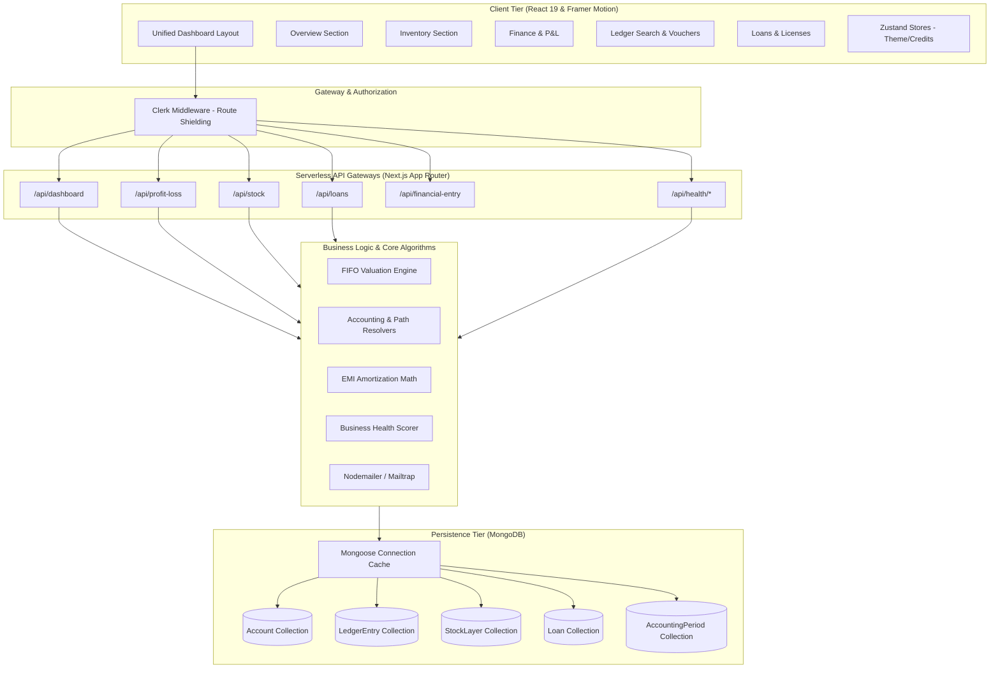

# 🚀 Solicio | Premium MSME Bookkeeping & Financial Dashboard

**[Live Demo](https://solicio-app.vercel.app/)**

[](https://nextjs.org/)
[](https://react.dev/)
[](https://tailwindcss.com/)
[](https://www.mongodb.com/)
[](https://clerk.com/)
[](https://www.typescriptlang.org/)

---

# Overview

Solicio is a simple and premium dashboard built for small and medium business owners to manage their business, money, and stock in one place.

Instead of jumping between messy spreadsheets, separate invoicing tools, and confusing accounting software, Solicio gives you a single, unified workspace to track everything. It takes care of the complex math in the background, showing you your real profit margins, inventory levels, and overall business health at a glance.

---

# Features at a Glance

*   **📊 Unified Dashboard:** A clean overview of your cash flow, active loans, and key business metrics.
*   **💸 Simple Bookkeeping:** Easily log sales, purchases, and payments. The app enforces balanced accounting entries automatically.
*   **📦 Stock Tracker & Valuation:** Keep track of exactly what inventory is left, its value, and get alerted when stock runs low.
*   **🏥 Business Health Score:** A simple score from 0 to 100 calculated from your sales trends and stock levels to let you know how your business is performing.
*   **📈 Sales & Margin Insights:** Smart charts showing your revenue growth and profit margins, along with recommendations to improve operations.
*   **🏦 Loan & License Alerts:** Track active business loans, calculate monthly payments, and get notified before regulatory business licenses expire.
*   **👥 Contact Directory:** Manage profiles for customers and suppliers to track who you owe money to and who owes you.

---

# How It Works (Under the Hood)

For developers or those interested in the technical details:

### 1. Hierarchical Chart of Accounts & Balanced Ledger
The system structures your accounts using a path-based hierarchy (e.g., `/Asset/Cash`, `/Expense/Purchases`). 
*   **Balanced Vouchers:** When you log transactions, the system checks that debits match credits before saving.
*   **Audit Lock:** Past accounting periods can be locked to prevent older records from being altered.

### 2. First-In First-Out (FIFO) Costing Engine
To calculate your exact Cost of Goods Sold (COGS) and profit margins:
*   Each batch of stock purchased is stored with its own cost and date.
*   When a sale happens, the system automatically subtracts inventory from the oldest available batch first.

### 3. Business Health Scoring Algorithm
The system calculates the 0-100 health score based on four key metrics:
*   **Stock Movement (30%):** Flags slow-moving items that are locking up cash.
*   **Sales Trend (30%):** Measures week-over-week revenue growth.
*   **Inventory Balance (20%):** Keeps track of stock-to-sales ratios to avoid stockouts.
*   **Activity Recency (20%):** Detects if there has been a long gap in operations.

---

# System Architecture

Solicio utilizes a **Domain-Driven Feature Slice** pattern layered over a serverless Next.js App Router environment to ensure modularity and clean API orchestration.



---

# 📂 Project Directory Structure

```filepath
solicio-next/
├── public/                 # Static assets, branding images, and logos
├── src/
│   ├── app/                # Next.js App Router entry points
│   │   ├── (root)/         # Public landing page & homepage wrapper
│   │   ├── api/            # Serverless API routes (37 modular endpoints)
│   │   │   ├── profit-loss/# Costing & Profit/Loss reports
│   │   │   ├── stock/      # Stock layer and valuation operations
│   │   │   ├── health/     # Telemetry & health scoring analytics
│   │   │   └── loans/      # Debt and loan schedules
│   │   ├── dashboard/      # Primary authenticated dashboard interface
│   │   ├── transactions/   # Ledger audits & stock movement lists
│   │   ├── layout.tsx      # Main layout injecting Clerk, Providers, and Google Fonts
│   │   └── middleware.ts   # Edge middleware routing & Clerk access protection
│   │
│   ├── components/         # Reusable presentation and UI elements
│   │   ├── layout/         # Shared Header, Footer, and Navigation
│   │   ├── ui/             # Core UI cards, badges, and print buttons
│   │   └── ThemeProvider.tsx# Context provider for dark/light mode switches
│   │
│   ├── features/           # Domain-Driven feature modules (UI logic & hooks)
│   │   ├── dashboard/      # Sidebar, KPI displays, and section layouts
│   │   ├── stock/          # Sales, purchases, recipe builders, and product forms
│   │   ├── ledger/         # General ledger displays, search, and reversals
│   │   ├── parties/        # Vendor & Customer catalogs and credit options
│   │   ├── voucher/        # Ledger journal creation matrices
│   │   ├── loan_licenses/  # Loan schedules and business certificates
│   │   ├── Insights/       # Recharts trend engines and financial graphs
│   │   └── health/         # Gauges, balance panels, and activity recency
│   │
│   ├── dbConfig/           # Database layer connection and caching
│   │   └── dbConnection.ts # Cached Mongoose connection helper
│   │
│   ├── models/             # 18 Mongoose ODM Schema Definitions
│   │   ├── AccountModel.ts # Hierarchical Chart of Accounts
│   │   ├── StockLayer.ts   # FIFO stock purchase layers
│   │   ├── LedgerEntry.ts  # Balanced double-entry records
│   │   └── LoanModel.ts    # Loan structure and liabilities
│   │
│   ├── utils/              # Pure business algorithms
│   │   ├── fifo.ts         # Cost of Goods Sold calculator
│   │   ├── emiCal.ts       # Loan amortization schedule calculator
│   │   ├── gst.ts          # Direct GST/tax rates parser
│   │   └── accounting.ts   # System accounts & fiscal lock controllers
│   │
│   ├── store/              # Zustand lightweight global state stores
│   ├── hooks/              # Custom global React state hooks
│   └── types/              # Centralized TypeScript declarations
│
├── package.json            # Dependencies, scripts, and package setup
└── tsconfig.json           # Strict TypeScript configuration compiler rules
```

---

# 🛠️ Getting Started & Installation

### Prerequisites
*   [Node.js](https://nodejs.org/) (v20+ recommended)
*   [MongoDB Atlas](https://www.mongodb.com/cloud/atlas) or a running local MongoDB instance
*   [Clerk account](https://clerk.com/) for authentication configuration

### Installation

1.  **Clone the Repository:**
    ```bash
    git clone https://github.com/jainbhavya359/Solicio-Next.git
    cd Solicio-Next
    ```

2.  **Install Dependencies:**
    ```bash
    npm install
    ```

3.  **Configure Environment Variables:**
    Create a `.env` file (or `.env.local`) in the root directory:
    ```env
    # Clerk Authentication Keys
    NEXT_PUBLIC_CLERK_PUBLISHABLE_KEY=pk_test_...
    CLERK_SECRET_KEY=sk_test_...

    # Database
    MONGODB_URI=mongodb+srv://<user>:<password>@cluster.mongodb.net/solicio

    # Optional Analytics (PostHog)
    NEXT_PUBLIC_POSTHOG_PROJECT_TOKEN=phc_...
    NEXT_PUBLIC_POSTHOG_HOST=https://us.i.posthog.com
    ```

4.  **Run in Development Mode:**
    ```bash
    npm run dev
    ```
    Open `http://localhost:3000` to view the landing page. Navigate to `/dashboard` to log in and access features.

5.  **Build for Production:**
    ```bash
    npm run build
    npm run start
    ```

---

# 💻 Tech Stack Highlights

*   **Framework:** Next.js 16.1 (App Router)
*   **Base Language:** React 19, TypeScript
*   **Styles & Transitions:** Tailwind CSS v4, `@tailwindcss/postcss`, Framer Motion, Lucide React
*   **Database ODM:** Mongoose (v9.1)
*   **Security:** Clerk Auth, Route Guard Middleware
*   **State Management:** Zustand (v5)
*   **Forms & Val:** React Hook Form (v7), Zod (v4)
*   **Charts & Visuals:** Recharts (v3)

---

# 📄 License

This project is private and proprietary. All rights reserved.
